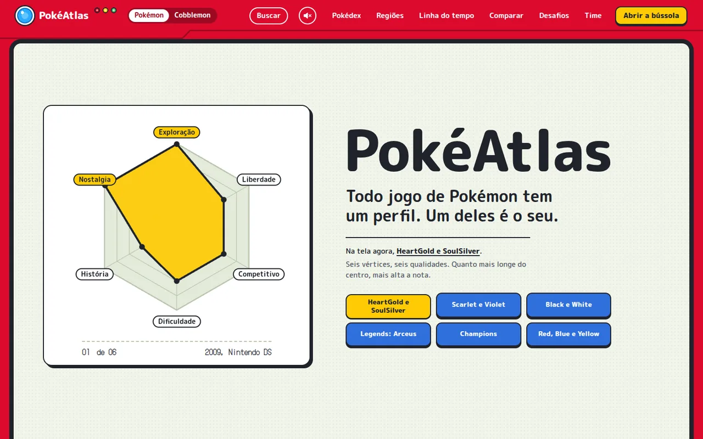
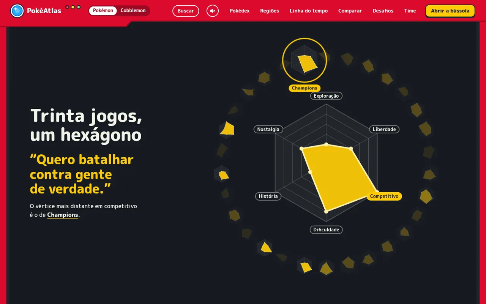
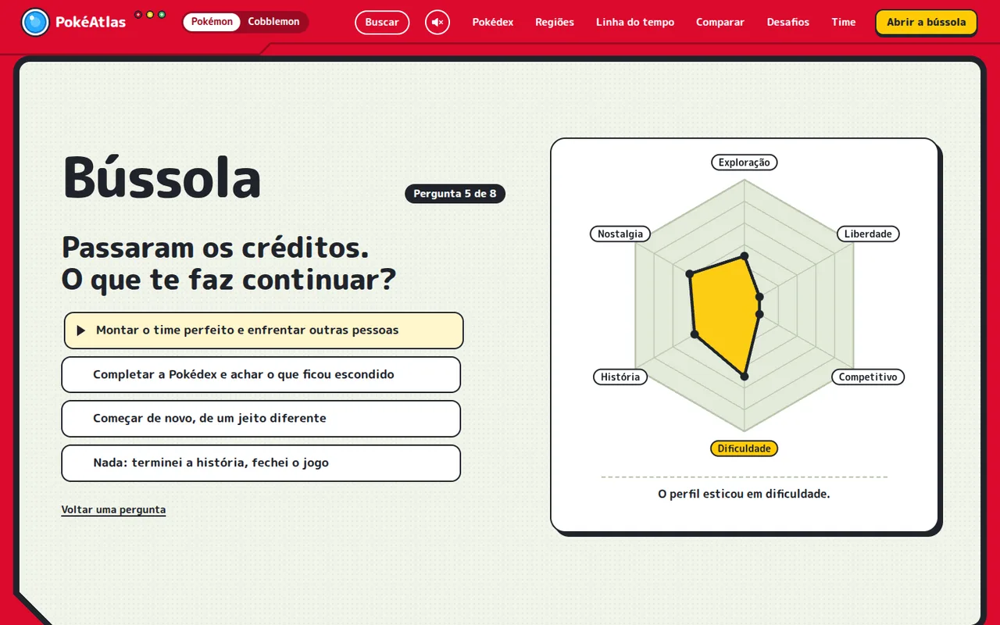
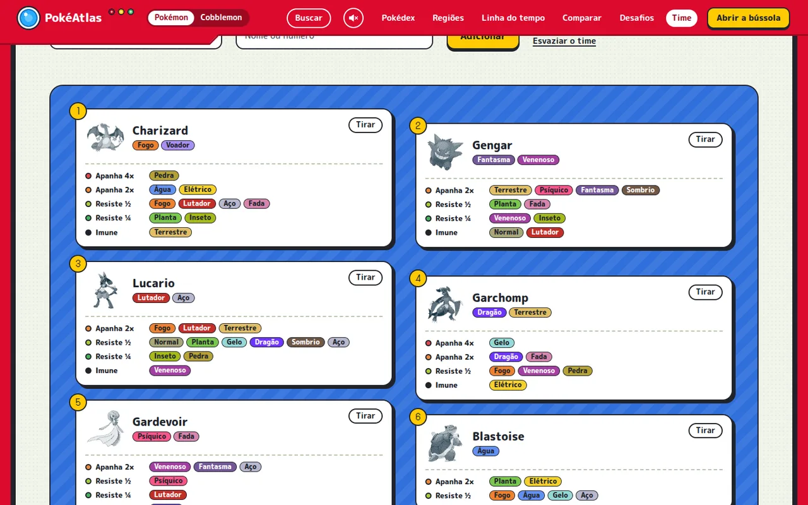
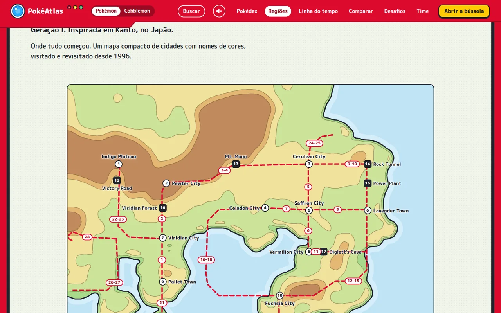
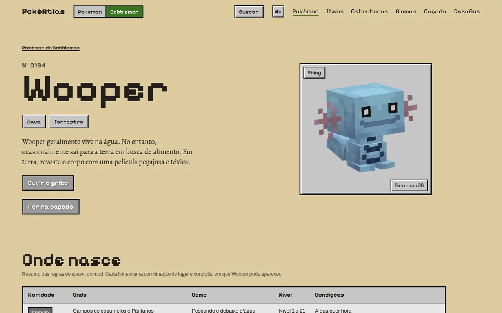

# 🗺️ PokéAtlas

<p align="center"><strong>Português</strong> · <a href="README.en.md">English</a></p>

<p align="center">
  <strong>Um guia visual e cartográfico para descobrir qual jogo de Pokémon combina com você.</strong>
</p>

<p align="center">
  <a href="https://pokeatlas-eight.vercel.app/" target="_blank">
    
  </a>
</p>

<p align="center">
  
  
  
  
  
  
  
</p>

<p align="center">
  
  
</p>
<p align="center">
  
  
</p>
<p align="center">
  
  
</p>

---

## 📌 Sumário

- [Sobre o Projeto](#-sobre-o-projeto)
- [A Assinatura: O Hexágono Vivo](#-a-assinatura-o-hexágono-vivo)
- [Funcionalidades Principais](#-funcionalidades-principais)
- [Direção de Arte e Design](#-direção-de-arte-e-design)
- [Arquitetura e Engenharia](#-arquitetura-e-engenharia)
- [Estrutura do Repositório](#-estrutura-do-repositório)
- [Como Rodar Localmente](#-como-rodar-localmente)
- [Scripts Disponíveis](#-scripts-disponíveis)
- [Deploy](#-deploy)
- [Avisos Legais e Créditos](#-avisos-legais-e-créditos)
- [Autor](#-autor)

---

## 🧭 Sobre o Projeto

O **PokéAtlas** é uma experiência interativa e editorial criada para acolher três perfis de jogadores:
1. **O nostálgico** que parou em gerações anteriores e quer reencontrar a franquia;
2. **O iniciante** curioso que não sabe por onde começar entre dezenas de títulos;
3. **O fã veterano** em busca de uma perspectiva visual inovadora sobre os jogos.

Em vez de uma wiki enciclopédica tradicional ou uma vitrine de e-commerce, o PokéAtlas adota o conceito de um **aparelho de Pokédex**: o corpo vermelho, a lente azul, as três luzes, a tela onde tudo acontece e as teclas. Cada jogo ganha um perfil próprio, um hexágono de seis atributos como o das telas de resumo dos jogos, que traduz a sua proposta de experiência numa forma.

🔗 **Acesse o site em produção:** [https://pokeatlas-eight.vercel.app/](https://pokeatlas-eight.vercel.app/)

---

## 🔶 A Assinatura: O Hexágono Vivo

Cada título é modelado através de seis atributos de gameplay fundamentais:

| Eixo | O que mede |
| :--- | :--- |
| **História** | Profundidade da narrativa, desenvolvimento de personagens e mitologia. |
| **Exploração** | Riqueza de rotas, segredos, biomas e labirintos fora do caminho principal. |
| **Dificuldade** | Curva de desafio dos ginásios, inteligência artificial e batalhas cruciais. |
| **Liberdade** | Autonomia na ordem dos objetivos, exploração aberta e escolha de rotas. |
| **Competitivo** | Complexidade mecânica de pós-jogo, breeding, EVs/IVs e profundidade tática. |
| **Nostalgia** | Memória afetiva, fidelidade estética de época e peso histórico. |

### Como o Hexágono é Desenhado
Cada atributo é um vértice, numa direção fixa. As notas (de 1 a 5) puxam o vértice:
- Quanto mais alta a nota, mais longe do centro o vértice vai.
- A forma que sobra é o **perfil do jogo**: dois jogos parecidos têm contornos que coincidem.
- Desenhado tanto em **SVG durante o build estático** quanto em **Canvas ao vivo** no navegador, onde o perfil se estica de uma forma para a outra em vez de pular.

---

## 🗺️ Funcionalidades Principais

### 1. 🧭 Bússola (Quiz de Recomendação) (`/bussola/`)
Um sistema de recomendação dinâmico com 8 perguntas de perfil. À medida que o visitante responde, o hexágono do seu perfil vai se desenhando ao vivo na tela. No final, o algoritmo compara a forma do perfil com a de todos os jogos do catálogo e recomenda os títulos de maior afinidade, explicando em quais vértices eles coincidiram.

### 2. 📖 Pokédex em Gravura (`/pokedex/` e `/pokedex/<especie>/`)
- **1.025 espécies de Pokémon** catalogadas.
- Apresentação visual em **gravura monocromática**, como numa tela de uma cor só, que recupera suas cores oficiais em hover/foco; os tipos aparecem em selos nas cores que os jogos usam.
- Busca instantânea e filtros por geração e tipo elemental.
- Páginas individuais com atributos base, dimensões, linha evolutiva completa, formas regionais e lista de jogos em que a espécie pode ser encontrada.
- **Formas especiais:** megaevoluções, Gigantamax, formas regionais e outras formas que mudam tipos ou atributos, cada uma com arte, tipos e atributos próprios; e a indicação de quais espécies podem usar Dynamax.
- **Curiosidades computadas proceduralmente:** fatos gerados por análise cruzada em tempo de compilação (exclusividade de tipos, outliers estatísticos de peso/tamanho, etc.), sem redação artificial.

### 3. 🗺️ Cartas das Regiões (`/regioes/` e `/regioes/<regiao>/`)
- Cartografia vetorial redesenhada das 10 regiões do universo Pokémon: **Kanto, Johto, Hoenn, Sinnoh, Unova, Kalos, Alola, Galar, Hisui e Paldea**.
- Traçado de costa, relevo altimétrico, cidades e marcos numerados.
- Rotas oficiais interligadas com **destaque bidirecional**: passar o cursor na rota da lista ilumina o mapa e vice-versa.
- Cartas que se desenham suavemente via SVG quando entram na janela de visualização.

### 4. ⚖️ Comparador de Perfis (`/comparar/`)
Permite selecionar até 3 jogos simultâneos e sobrepor seus hexágonos em três cores (as dos primeiros companheiros: água, fogo e planta), facilitando a análise ponto a ponto das diferenças de ritmo e estilo de cada jogo.

### 5. ⏳ Linha do Tempo da Franquia (`/linha-do-tempo/`)
Uma régua cronológica abrangendo de **1996 a 2027**, separada por plataformas/consoles (do Game Boy original ao Nintendo Switch), servindo também como índice canônico completo dos jogos analisados.

### 6. 🎲 Desafios (`/desafios/` e `/desafios/<desafio>/`)
- **Dez maneiras alternativas de jogar**, uma para cada região, cada uma com sinopse, regras, condição de vitória e de derrota (a primeira é "Os Super Woopers").
- **Diário de desafio** (`/diario/`): acompanha uma campanha (Nuzlocke, um desafio do atlas ou regras suas), com capturas por rota, time, caixa, quem caiu e insígnias. Em 12 jogos mostra o que aparece em cada rota, com a tabela de encontros da PokéAPI. Fica guardado no navegador e exporta para arquivo. Cada desafio e a roleta abrem o diário já com as regras anotadas.
- **Roleta de desafios:** sorteia um jogo, uma regra para o time, complicações e uma condição de vitória. As espécies e os tipos sorteados existem na Pokédex do jogo sorteado, e cada sorteio tem link próprio (`?roleta=...`), que reproduz o mesmo desafio.

### 7. ⛏️ Edição Cobblemon (`/cobblemon/`)
Uma segunda edição do atlas, sobre o mod [Cobblemon](https://cobblemon.com/) para Minecraft, escolhida no seletor do topo. Tem tema próprio (pergaminho de mapa, painéis de inventário, letra de pixel) e os Pokémon desenhados a partir dos modelos do próprio mod: nas listas eles ficam em tinta de mapa e ganham a cor do jogo quando você aponta; os que você abre ficam revelados de vez. Os itens têm o ícone do mod e giram ao apontar; as estruturas e os biomas aparecem em maquetes de blocos que giram em 3D (WebGL, sem biblioteca).
- **Pokémon** (`/cobblemon/pokemon/`): as 888 espécies já implementadas, com os biomas em que nascem, raridade, condições, o que deixam cair, montaria e como evoluem dentro do mod. Na página de cada uma, **Girar em 3D** troca o retrato pelo modelo do mod (com zoom e tela cheia) e **Shiny** troca a textura.
- **Itens** (`/cobblemon/itens/`): 490 itens e blocos em português, com ícone, as receitas desenhadas como no jogo (bancada, panela de fogueira, suporte de poções, fornalha, ferraria), os Pokémon que deixam cair cada um e, nas bagas, os pares que geram cada uma por mutação.
- **Estruturas** (`/cobblemon/estruturas/`): as 65 estruturas que o mod gera, em maquetes 3D com zoom, com o bioma de cada uma e os Pokémon que nascem ali.
- **Biomas** (`/cobblemon/biomas/`): os 11 ambientes em maquetes 3D que giram, com as espécies e as estruturas de cada um, e as informações gerais do mod (como ele decide o que nasce, fósseis, versões e curiosidades calculadas dos dados).
- **Caçada** (`/cobblemon/cacada/`): você marca os Pokémon que quer e o atlas diz em que bioma dá para achar mais deles de uma vez, com raridade e condições.
- **Desafios** (`/cobblemon/desafios/`): cinco desafios para começar um mundo novo, e a roleta.
- Todos os dados são extraídos dos arquivos da versão **1.8.1** do mod por `scripts/cobblemon.mjs`.

### 8. 🧰 Ferramentas do Treinador
- **Montar um time** (`/time/`): até seis Pokémon, no formato da tela de equipe dos jogos. Cada vaga mostra os tipos do Pokémon e o que ele recebe em quádruplo ou em dobro, a que resiste e do que é imune; embaixo, a leitura do time em selos de tipo (os buracos, os tipos sem resposta, de que o time apanha e o que ele segura). Filtra pela Pokédex de cada jogo, e o time vai no endereço.
- **Comparar Pokémon** (`/comparar/pokemon/`): atributos de base de dois Pokémon frente a frente.
- **Busca global:** o botão **Buscar** e os atalhos `/` e `Ctrl+K` acham jogos, regiões, Pokémon, desafios, itens, estruturas e biomas de qualquer página.

### 9. 🎬 Prólogo Cinematográfico da Home (`/`)
Jornada contínua dividida em 6 cenas orientadas pelo scroll:
1. *O aparelho liga:* as tampas da tela se abrem e o hexágono de um jogo aparece, como a ficha de uma Pokédex; o teclado azul troca o perfil mostrado.
2. *As regiões:* carrossel panorâmico das 10 regiões, cada uma num cartão com a sua carta e os iniciais.
3. *Trinta anos:* métricas temporais em letra de pontos e a régua de anos.
4. *O hexágono responde (o clímax):* a tela apaga; cada pedido puxa um vértice, o hexágono toma a forma do jogo escolhido e, em volta, acendem os perfis dos jogos que vão longe naquela direção.
5. *As ferramentas:* vitrine da Pokédex e comparador.
6. *O seu perfil:* a tela inteira em amarelo e o convite para abrir a bússola.

### 10. 🔊 Som
O atlas abre em silêncio. O botão do alto-falante, no cabeçalho, abre um painel com a chave que liga o som e um volume para a música e outro para as teclas; as escolhas ficam guardadas no navegador.
- **Música de fundo:** uma por edição, composta para o atlas e tocada na hora pelo navegador (Web Audio), sem arquivo de áudio. Na edição Pokémon, uma melodia em ondas quadradas, como num portátil; na edição Cobblemon, notas soltas e longas, com eco. Quem troca de página continua a música mais ou menos de onde ela estava.
- **Sons das teclas:** bipes de aparelho na edição Pokémon e o estalo de menu em blocos na edição Cobblemon.
- **Gritos:** a página de cada espécie, nas duas edições, tem o botão **Ouvir o grito**, que toca o grito do Pokémon nos jogos. Esse funciona mesmo com o som do atlas desligado.

### 11. 🌍 Versão em inglês (`/en/` e `/en/compass/`)
A página inicial e a bússola existem também em inglês, com os nomes dos eixos, as chamadas e as notas dos jogos, os textos das regiões e as oito perguntas traduzidos. O link **English** fica no menu das duas páginas. As outras seções seguem só em português, e as páginas em inglês avisam disso nos links que levam a elas.

### 12. 📲 Para instalar e compartilhar
- **Instalar no celular:** o atlas tem manifesto e ícones, e pode ser adicionado à tela inicial como um aplicativo.
- **Prévia de link:** cada página traz a imagem que aparece quando o endereço é colado numa rede social ou numa conversa.
- **Mapa do site:** `sitemap.xml` e `robots.txt` são gerados no build, com todas as páginas.

---

## 🎨 Direção de Arte e Design

| Elemento | Implementação | Inspiração |
| :--- | :--- | :--- |
| **Corpo do Aparelho** | `#DC0A2D` (vermelho de Pokédex), no fundo da página, no alto e no rodapé | A Pokédex dos jogos e do desenho |
| **Tela** | `#F1F5EA` (tela acesa, com trama de pontos) e `#171A21` (tela apagada) | Telas de cristal líquido dos portáteis |
| **Tinta Principal** | `#20232B` (grafite), em texto, bordas e sombras duras | Caixas de texto e menus dos jogos |
| **Acentos** | `#FFCB05` (amarelo das teclas e do hexágono) e `#29AAFD` (a lente) | O logotipo e a lente do aparelho |
| **Notas e Tipos** | Barra de vida do vermelho ao verde para as notas; as 18 cores dos tipos nos selos | Barras de PS e selos de tipo dos jogos |
| **Tipografia** | **M PLUS Rounded 1c** (títulos e texto) + **DotGothic16** (números e leituras da tela) | Letreiros arredondados e letra de pontos dos portáteis |

A edição Cobblemon tem direção própria (pergaminho de mapa, painéis de inventário, **Pixelify Sans**, **Archivo** e **Alegreya**), em `src/estilo.css`.

---

## ⚡ Arquitetura e Engenharia

- **Zero Dependências em Produção:** Sem frameworks pesados (sem React, Vue, Next.js ou Tailwind). Toda a aplicação roda sobre HTML5 semântico, CSS moderno (com variáveis e Grid/Flexbox) e Vanilla JavaScript (ES Modules).
- **Gerador de Sites Estáticos (SSG) sob medida:** O script `scripts/build.mjs` valida todo o modelo de dados e gera **1.988 páginas HTML estáticas prontas em ~1,2 segundos**.
- **Performance Extrema:** Carregamento instantâneo, First Contentful Paint (FCP) quase imediato e consumo mínimo de recursos no cliente.
- **3D sem biblioteca:** as maquetes de estruturas e biomas e os modelos de Pokémon giram num visor próprio (`src/js/visor.js`), com WebGL e, onde o navegador não o entrega, um desenhista de software.
- **Som sem arquivo de música:** a trilha e os efeitos são partituras escritas em texto (`src/js/som-logica.js`) e tocadas com osciladores; só os gritos dos Pokémon são arquivos.
- **Duas línguas sem duplicar página:** a moldura, o início e a bússola recebem a língua como parâmetro; as frases estão em `scripts/textos.mjs` e as traduções do conteúdo em `dados/en.mjs`, e o build falha se alguma tradução ficar para trás.
- **Testes:** as regras de cada ferramenta ficam em módulos puros (`src/js/*-logica.js`) testados com `node:test`; roteiros de navegador em `testes/navegador/` conferem cada página com Playwright.
- **Validação Rigorosa em Build:** O processo de compilação valida previamente cada rota, nota de 1 a 5, compatibilidade de Pokédex e coerência cartográfica antes de emitir a pasta de distribuição.

---

## 📂 Estrutura do Repositório

```bash
Projeto-Vitrine-Jogos/
├── dados/                       # Conteúdo canônico e bases de dados
│   ├── atlas.mjs                # Regiões, cidades, rotas e consoles
│   ├── jogos.mjs                # Títulos, atributos (1 a 5), mascotes e plataformas
│   ├── desafios.mjs             # Desafios escritos e peças da roleta
│   ├── en.mjs                   # O que o início e a bússola dizem em inglês
│   ├── pokedex.json, fichas.json, tipos.json, encontros.json   # Espécies, fichas, tipos e encontros por rota (PokéAPI)
│   ├── cartas.json              # Coordenadas vetoriais das cartas das regiões
│   ├── cobblemon.json           # Espécies, spawns, itens, receitas e estruturas (extraído do mod)
│   └── modelos*.json, maquetes.json, itens-arte.json   # Índices da arte gerada
│
├── scripts/                     # Motor do SSG e automação de dados
│   ├── build.mjs                # Compilador principal (gera dist/ sem dependências)
│   ├── paginas*.mjs             # Templates: principais, Pokédex, Cobblemon, desafios e ferramentas
│   ├── textos.mjs               # As frases da moldura, do início e da bússola, em português e em inglês
│   ├── dados-navegador.mjs      # Módulos de dados que o navegador importa (dist/js/dados/)
│   ├── baixar-mod.mjs           # Baixa o Cobblemon 1.8.1 (e o Minecraft) para .mod/, fora do Git
│   ├── cobblemon.mjs            # Extrator dos dados do mod
│   ├── modelos.mjs              # Desenha os Pokémon do mod e exporta os modelos 3D
│   ├── maquetes.mjs, itens-arte.mjs   # Maquetes das estruturas e ícones dos itens
│   ├── pokedex.mjs, fichas.mjs, tipos.mjs, encontros.mjs, arte.mjs, cartas.mjs, malha.mjs   # Dados e arte da edição Pokémon
│   ├── gritos.mjs               # Baixa o grito de cada espécie (PokeAPI/cries)
│   ├── vitrine.mjs, icone.mjs   # Ícones de instalação, imagens de prévia dos links e capturas do README
│   ├── servir.mjs               # Servidor HTTP local para desenvolvimento
│   └── verificar-paginas.mjs    # Auditoria visual: rola cada página e tira fotos
│
├── src/                         # Código-fonte da interface
│   ├── pokedex.css              # Folha de estilo da edição Pokémon (o aparelho de Pokédex)
│   ├── estilo.css               # Folha de estilo da edição Cobblemon (o mapa em blocos)
│   ├── fontes/                  # M PLUS Rounded 1c, DotGothic16, Pixelify Sans, Archivo e Alegreya (SIL OFL)
│   ├── js/                      # Lógica client-side modularizada
│   │   ├── hexagono.js          # O hexágono de atributos: vértices, SVG e semelhança entre perfis
│   │   ├── hex-vivo.js          # O hexágono desenhado ao vivo, que se estica de um perfil a outro
│   │   ├── rolagem.js           # Animações de rolagem das páginas de abertura
│   │   ├── visor.js             # Visor 3D: giro, zoom, tela cheia
│   │   ├── maquete*.js, modelo*.js   # Desenhistas de maquetes e de modelos de Pokémon
│   │   ├── som.js, som-logica.js   # Música, sons das teclas e gritos; as partituras das duas músicas
│   │   ├── *-logica.js          # Regras testáveis: time, diário, caçada, busca, som
│   │   └── ...                  # Um módulo por página (bussola, pokedex, time, diario...)
│   ├── arte/                    # Gravuras, modelos desenhados, ícones e maquetes paradas
│   ├── gritos/                  # O grito de cada espécie, em .ogg
│   ├── maquetes/                # Blocos das estruturas e dos biomas, para o visor
│   └── modelos3d/               # Modelo e textura de cada Pokémon do Cobblemon, para o visor
│
├── testes/                      # Testes de unidade (node:test) e roteiros de navegador
├── docs/                        # Plano de implementação, texto de divulgação e capturas de tela
├── LICENSE                      # Licença MIT do código, com a ressalva do material de terceiros
├── BRIEF.md                     # Decisões de direção de arte e de conteúdo, rodada a rodada
├── package.json                 # Scripts e ferramentas auxiliares
└── vercel.json                  # Roteamento e configuração de deploy
```

---

## 💻 Como Rodar Localmente

### Pré-requisitos
- **Node.js 20+** instalado em sua máquina.

### Passo a Passo

1. **Clone o repositório:**
   ```bash
   git clone https://github.com/Avendanho/Projeto-Vitrine-Jogos.git
   cd Projeto-Vitrine-Jogos
   ```

2. **Inicie o ambiente de desenvolvimento:**
   O build nativo **não necessita de `npm install`** para compilar e rodar o site!
   ```bash
   npm run dev
   ```
   O site será compilado em `dist/` e disponibilizado localmente em:
   👉 **`http://localhost:4600`**

3. **Apenas gerar o build de produção:**
   ```bash
   npm run build
   ```

4. **Rodar os testes:**
   ```bash
   npm test                  # regras das ferramentas, sem navegador e sem dependências
   npm install               # só para os roteiros de navegador e os scripts de arte
   npm run test:navegador    # com `npm run dev` rodando em outro terminal
   ```

---

## 🛠️ Scripts Disponíveis

| Comando | Descrição |
| :--- | :--- |
| `npm run dev` | Compila o site em `dist/` e inicia o servidor local em `http://localhost:4600`. |
| `npm run build` | Valida as regras de negócio e compila todas as 1.988 páginas HTML. |
| `npm test` | Testes de unidade das regras (time, diário, caçada, busca, modelos, som, dados). |
| `npm run test:navegador` | Roteiros de navegador de todas as ferramentas (precisa do `npm run dev` rodando). |
| `npm run verificar` | Auditoria visual: rola cada página em desktop, celular e movimento reduzido e tira fotos. |
| `npm run pokedex` | *(Dados)* Reconstrói `pokedex.json` e `fichas.json` a partir da PokéAPI. |
| `npm run tipos` | *(Dados)* Baixa a tabela de efetividade dos 18 tipos. |
| `npm run encontros` | *(Dados)* Baixa a tabela de encontros por rota de cada jogo. |
| `npm run gritos` | *(Som)* Baixa o grito de cada espécie para `src/gritos/`. |
| `npm run vitrine` | *(Divulgação)* Refaz os ícones de instalação, as imagens de prévia dos links e as capturas do README (precisa do `npm run dev` rodando). |
| `npm run arte`, `arte:mini`, `arte:formas` | *(Arte)* Pranchas dos mascotes, gravuras de todas as espécies e arte das formas especiais. |
| `npm run cartas` | *(Arte)* Recalcula os traçados das cartas das regiões. |
| `npm run mod -- --minecraft` | *(Cobblemon)* Baixa o mod 1.8.1 e os arquivos do Minecraft para `.mod/`, que fica fora do Git. É o primeiro passo para os quatro comandos abaixo. |
| `npm run cobblemon -- --fonte .mod` | *(Cobblemon)* Reconstrói `cobblemon.json` (espécies, spawns, itens, receitas, estruturas). |
| `npm run modelos -- --fonte .mod` | *(Cobblemon)* Desenha os Pokémon a partir dos modelos do mod; com `--3d`, exporta os modelos e as texturas para o visor. |
| `npm run itens -- --ativos <ativos> --minecraft <minecraft>` | *(Cobblemon)* Atlas de ícones dos itens e dos ingredientes das receitas. |
| `npm run maquetes -- --dados <dados> --ativos <ativos> --minecraft <minecraft>` | *(Cobblemon)* Maquetes 3D das estruturas e dos biomas. |

Nos dois últimos, `<ativos>` é `.mod/common/src/main/resources/assets/cobblemon`, `<dados>` é `.mod/common/src/main/resources/data/cobblemon` e `<minecraft>` é `.mod/minecraft/assets/minecraft`.

---

## 🚀 Deploy

O projeto é configurado nativamente para publicação contínua na **Vercel** através do arquivo `vercel.json`:

- **Comando de Build:** `node scripts/build.mjs`
- **Diretório de Saída:** `dist`
- Cada `push` no branch `main` dispara automaticamente o build e a publicação das páginas atualizadas.

---

## ⚖️ Avisos Legais e Créditos

- **Código:** o código-fonte deste repositório está sob a [licença MIT](LICENSE). Ela não alcança o material de terceiros listado abaixo.
- **Pokémon:** Pokémon, nomes dos jogos, criaturas e insígnias são marcas registradas e propriedades intelectuais da **Nintendo**, **Game Freak**, **Creatures Inc.** e **The Pokémon Company**. Este é um projeto de fã, não oficial, de caráter artístico e informativo, sem fins lucrativos e sem qualquer vínculo comercial.
- **Dados e Sprites:** Nomes, estatísticas e ilustrações oficiais foram obtidos por meio da [PokéAPI](https://pokeapi.co/) e tratados artisticamente em formato de gravura.
- **Som:** a música e os sons das teclas são originais do projeto, gerados no navegador. Os gritos dos Pokémon são os dos jogos, obtidos do repositório público [PokeAPI/cries](https://github.com/PokeAPI/cries), e pertencem à The Pokémon Company.
- **Cartografia:** Todas as cartas das regiões são redesenhos originais e interpretações artísticas desenvolvidas especificamente para o atlas.
- **Minecraft:** os nomes de itens e biomas do jogo base vêm da tradução oficial. As maquetes usam a cor média de cada bloco, e os ingredientes do Minecraft nas receitas aparecem em quatro tons de tinta, redesenhados a partir dos ícones do jogo; as texturas originais não são redistribuídas. Minecraft é marca da Mojang e da Microsoft, e este projeto não tem vínculo com elas.
- **Tipografia:** Fontes [M PLUS Rounded 1c](https://fonts.google.com/specimen/M+PLUS+Rounded+1c), [DotGothic16](https://fonts.google.com/specimen/DotGothic16), [Archivo](https://fonts.google.com/specimen/Archivo), [Alegreya](https://fonts.google.com/specimen/Alegreya) e [Pixelify Sans](https://fonts.google.com/specimen/Pixelify+Sans), licenciadas sob a *SIL Open Font License*.
- **Cobblemon:** mod de código aberto da equipe Cobblemon, sob a licença *MPL 2.0*. `dados/cobblemon.json` é derivado dos arquivos de dados e da tradução em português do mod. Os modelos, texturas e poses dos Pokémon (`src/arte/modelo/` e `src/modelos3d/`), os ícones dos itens (`src/arte/itens.png`, `src/arte/item/`) e as peças de estrutura usadas nas maquetes (`src/maquetes/`) são obra da equipe do Cobblemon, desenhados ou exportados pelos scripts deste repositório. Este projeto não tem vínculo com ela.

---

## 👤 Autor

Desenvolvido por **Bernardo Avendanho**  
- **GitHub:** [@Avendanho](https://github.com/Avendanho)  
- **Projeto Online:** [https://pokeatlas-eight.vercel.app/](https://pokeatlas-eight.vercel.app/)

---
<p align="center">
  <sub>PokéAtlas — Feito com paixão por exploração, cartografia e Pokémon.</sub>
</p>
